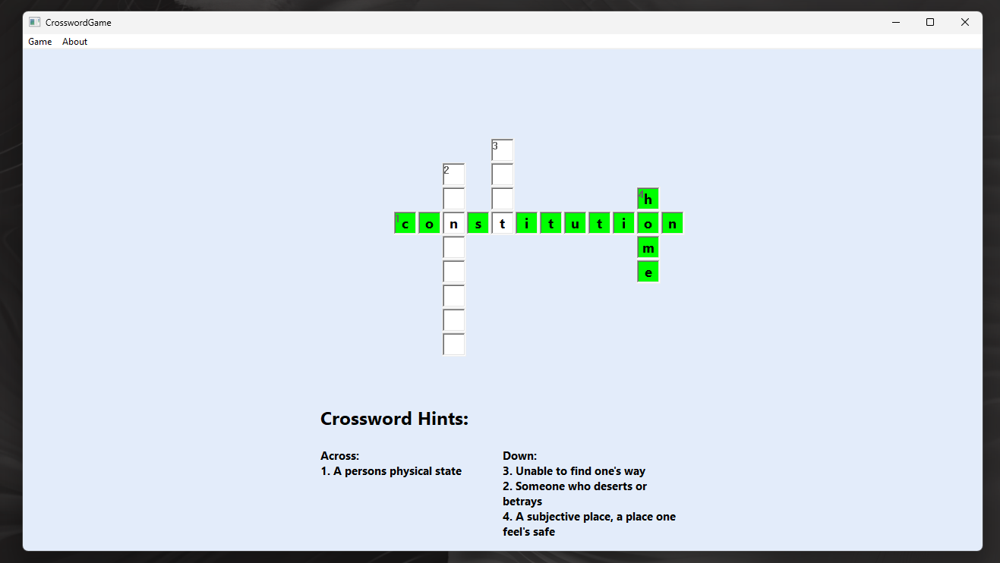
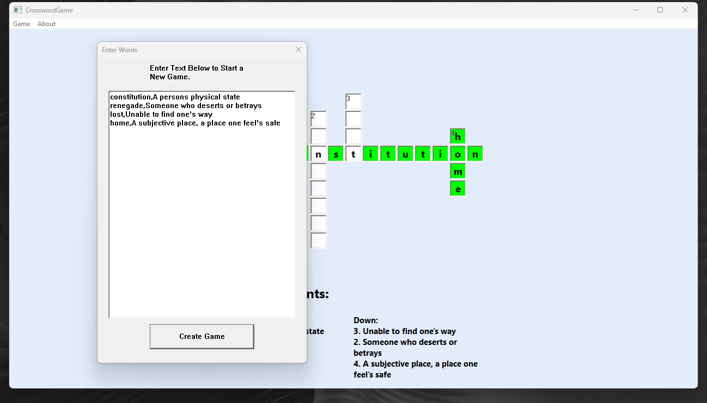

# Crossword Game (C++ / Win32 API)

A custom crossword game engine built from scratch using the Win32 API. No external game engines or UI libraries—just raw C++, Windows messages, and GDI drawing.

## Key Features

- **Custom Word Placement Engine**: Automatically handles horizontal and vertical word intersections using a weighted placement algorithm.
- **Subclassed UI Controls**: High-level hijacking of standard Windows EDIT controls to handle grid navigation and custom rendering.
- **Dynamic Board Resizing**: Math-based layout system that scales the grid and fonts based on the window size.
- **Game State Management**: Save and Load functionality via text serialization.

## Technical Deep Dive (The Cool Stuff)

### The Hijacker (Subclassing)
One of the most interesting parts of this project is how I handled the grid. Standard Win32 textboxes don't support things like "Arrow Key Jumping" or "Tiny Clue Numbers." 

I used a `SetWindowLongPtr` trampoline to inject a custom brain (`TileSubclassProc`) into every single textbox. This lets me:
- **Arrow Keys Movement**: Stop the default cursor movement and instead teleport the user to the next logical tile.
- **Last-Second Painting**: Catch the `WM_PAINT` message, let the textbox draw itself, then immediately stamp the clue number in the corner before the screen refreshes.

### The Placement Logic
The game doesn't just put words anywhere. It uses a `while(madeProgress)` loop to sweep through the word list. 
1. Sorts words by length (Longest first to build a solid anchor).
2. Places the first word in the dead center.
3. Sweeps through the remaining words, checking every possible intersection until the board is optimized.

## How to Build
- Open `CrosswordGame.sln` in **Visual Studio 2022**.
- Build for **x64** (Debug or Release).
- **Note**: Ensure SubSystem is set to `Windows` and Additional Include Directories include `$(SolutionDir)`.

## Project Structure
- `Core/`: The brain of the game. Handles word placement and board logic.
- `UI/`: The skin. Handles window messages, control creation, and GDI drawing.
- `Models/`: Data structures (Tiles, Vectors, Board).
